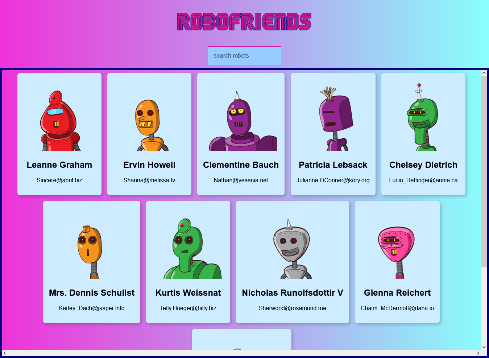

<h1>Robofriends :robot:</h1>

<h2>A website that lets you search for robot friends using the robot API.</h2>

This website is responsive using React. I created this following the web developer bootcamp of Andrei Neagoie on Udemy. I enjoyed building this project. This project used Tachyons, and used an API to pull up the images of the robots using the search box to type out a letter to see if a robot appears. Certain parts of the coding process were difficult but I definity learned more about React.

### Link

- Live Site: [Robofriends](https://robofriends13.netlify.app/)

### Screenshot

